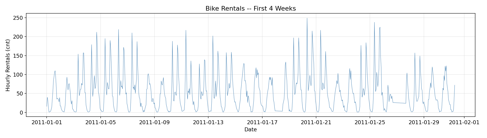
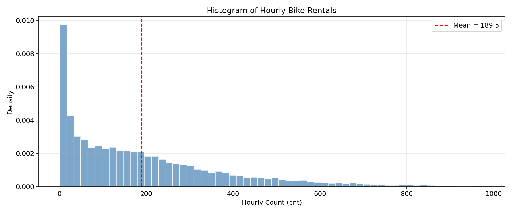
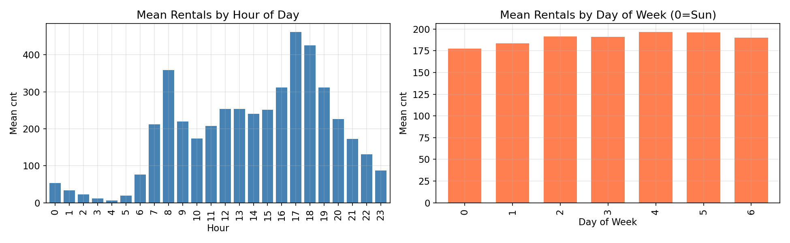
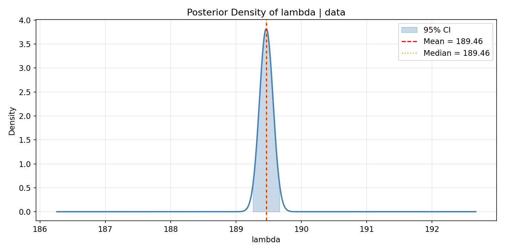
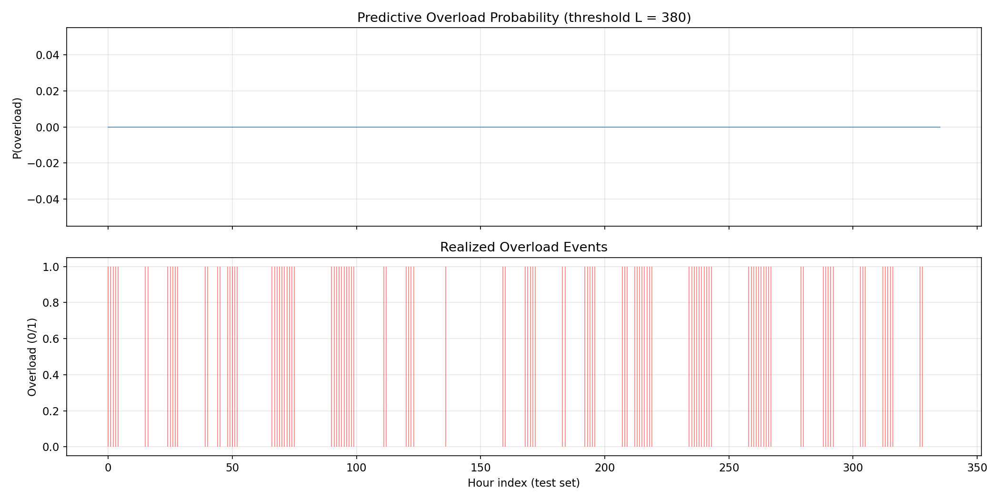
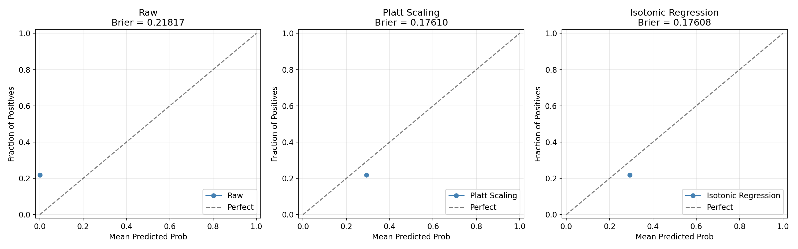
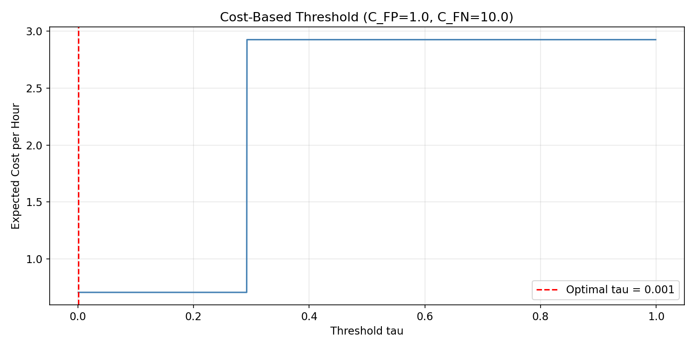
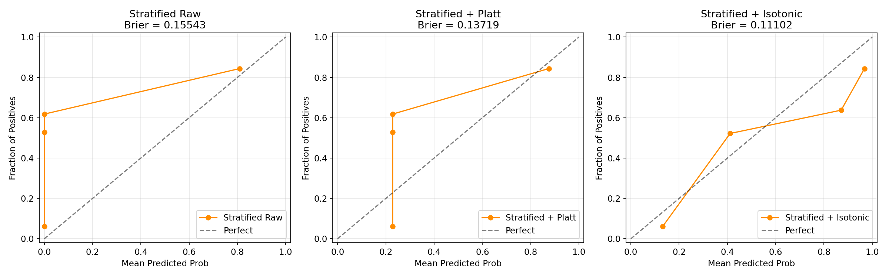
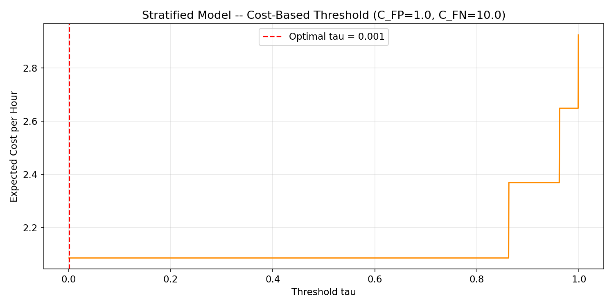

# Bayesian Analysis of Bike Sharing Demand: A Poisson–Gamma Framework

**Dataset:** UCI Bike Sharing Dataset (Fanaee-T, 2013)  
**Source:** [UCI ML Repository — ID 275](https://archive.ics.uci.edu/dataset/275/bike+sharing+dataset)  
**Records:** 17,379 hourly observations (Jan 2011 – Dec 2012)

---

## 1. Data Acquisition and Exploratory Data Analysis

The dataset contains hourly bike rental counts (`cnt`) from the Capital Bikeshare system in Washington, D.C., alongside weather, calendar, and seasonal covariates.

### Summary Statistics

| Statistic | Value |
|---|---|
| Number of records | 17,379 hours |
| Time span | 2011-01-01 to 2012-12-31 |
| Sample mean (Ȳ) | 189.46 |
| Sample variance (s²) | 32,899.57 |
| Variance / Mean ratio | 173.65 |

### Time Series — First 4 Weeks



The time series reveals strong daily periodicity with clear commute-hour peaks on workdays and a single midday hump on weekends. Night-time counts drop near zero.

### Distribution of Hourly Counts



The histogram is heavily right-skewed with a mode near zero and a long right tail extending past 900. This shape is far from the near-symmetric bell a Poisson(λ ≈ 189) distribution would produce.

### Seasonal Patterns



- **Hour of day:** Two sharp commute peaks near 8 AM and 5–6 PM on workdays, with a broad midday plateau on weekends.
- **Day of week:** Slightly higher average counts on workdays (Mon–Fri) compared to weekends, reflecting commuter-dominated ridership.

### Key Conclusion

> A homogeneous Poisson(λ) model is **not plausible** for these data. The variance-to-mean ratio of 174× indicates massive overdispersion. The distribution shape, strong hour-of-day effects, and day-of-week patterns all violate the Poisson assumption of a single constant rate.

---

## 2. Poisson Likelihood and Maximum Likelihood Estimation

Despite the model's inadequacy, we derive the MLE as a baseline under the homogeneous Poisson assumption.

### Likelihood

The Poisson likelihood for i.i.d. observations Y₁, ..., Y_T is:

```
L(λ; y₁:T) = ∏ᵢ λ^yᵢ · exp(−λ) / yᵢ!
            = λ^(Σyᵢ) · exp(−Tλ) · ∏(1/yᵢ!)
```

### Log-Likelihood

```
ℓ(λ) = Σyᵢ · ln(λ) − Tλ   (omitting constant terms)
```

### MLE Derivation

Setting dℓ/dλ = 0:

```
Σyᵢ / λ − T = 0   →   λ_MLE = (1/T) · Σyᵢ = Ȳ
```

### Numerical Results

| Quantity | Value |
|---|---|
| Σyᵢ | 3,292,679 |
| T | 17,379 |
| **λ_MLE** | **189.4631** |

**Interpretation:** Under this overly simple model that treats every hour identically, the estimated hourly rental rate is about 189. This estimate captures the overall average but ignores all temporal structure — it cannot distinguish a 3 AM lull from a 5 PM rush.

---

## 3. Gamma Prior and Conjugate Posterior

### Prior Specification

We place a weakly informative Gamma prior on λ:

```
λ ~ Gamma(α = 2.0, β = 0.01)     (shape/rate parameterisation)
```

This prior has mean α/β = 200, loosely centered near the data mean, but with enormous variance (α/β² = 20,000) — so it is intentionally non-informative.

### Conjugate Update

The Gamma distribution is conjugate to the Poisson likelihood, giving a closed-form posterior:

```
λ | data ~ Gamma(α + Σyᵢ,  β + T)
```

### Posterior Parameters

| Parameter | Prior | Posterior |
|---|---|---|
| α (shape) | 2.0 | 3,292,681 |
| β (rate) | 0.01 | 17,379.01 |

### Posterior Summary

| Quantity | Value |
|---|---|
| Posterior mean | 189.4631 |
| MLE | 189.4631 |
| Difference | 0.000006 |

### Shrinkage Interpretation

The posterior mean can be written as a weighted average:

```
E[λ|data] = [β/(β+T)] · (α/β) + [T/(β+T)] · Ȳ
          = 0.000001 · 200  +  0.999999 · 189.46
```

The weight on the prior mean is essentially zero (0.0001%). With only α = 2 pseudo-counts from 0.01 pseudo-hours of imaginary data, the prior is completely overwhelmed by the 17,379 real observations. The posterior is dominated by the data, as expected with a weakly informative prior.

---

## 4. 95% Credible Interval

The 95% equal-tailed credible interval for λ is obtained from the Gamma(3,292,681, 17,379.01) posterior quantiles:

| Quantity | Value |
|---|---|
| 2.5th percentile | 189.2585 |
| Posterior median | 189.4631 |
| Posterior mean | 189.4631 |
| 97.5th percentile | 189.6678 |
| **95% CI width** | **0.409** |

### Posterior Density



The credible interval is extremely narrow (width ≈ 0.41) because the effective sample size is T = 17,379, making the posterior highly concentrated around the MLE. The mean and median are virtually identical, reflecting the near-symmetry of Gamma distributions with very large shape parameters.

---

## 5. Posterior Predictive Distribution and Overload Alert

### Data Splitting

| Split | Hours | Purpose |
|---|---|---|
| Training | 12,165 (70%) | Model fitting |
| Validation | 2,606 (15%) | Calibration & threshold tuning |
| Test | 2,608 (15%) | Final evaluation |

### Overload Definition

An **overload event** is defined as an hour where the rental count exceeds the 90th percentile of the training data:

```
Overload when Yₜ > L,    L = 380    (90th percentile of training counts)
```

| Split | Overload base rate |
|---|---|
| Validation | 29.24% |
| Test | 21.82% |

### Posterior Predictive Distribution

Given the conjugate posterior, the predictive distribution for a new observation is Negative Binomial:

```
Y_{t+1} | data ~ NegBin(n = α_post, p = β_post / (β_post + 1))
```

The overload probability is P(Y > L | data) = 1 − F_{NB}(L; α\_post, p), computed via sequential updating through the validation and test sets.

### Predictive Overload Probabilities



The top panel shows predicted overload probabilities over the first 2 weeks of the test set. The bottom panel shows where actual overload events occurred (red vertical lines). Under the homogeneous model, all hours receive essentially the same predicted probability — the model has **no ability to discriminate** which hours will experience overload.

---

## 6. Calibration

Calibration measures whether predicted probabilities match observed frequencies. A model can discriminate well (rank overload hours higher) yet still be miscalibrated.

### Brier Score (Test Set)

| Method | Brier Score |
|---|---|
| Raw (posterior predictive) | 0.2182 |
| Platt Scaling | 0.1761 |
| Isotonic Regression | 0.1761 |

The raw Brier score (0.2182) is essentially equal to the overload base rate (0.2182), confirming that the homogeneous model provides **no useful probabilistic information** — it performs no better than predicting the base rate for every hour.

Platt scaling and isotonic regression reduce the Brier score modestly, but the fundamental problem is discrimination, not calibration.

### Reliability Diagrams



The reliability diagrams show how predicted probabilities align with actual overload frequencies across bins. A perfectly calibrated model would follow the diagonal. Calibration post-processing (Platt/isotonic) improves the score-to-probability mapping without changing the rank ordering.

### Discrimination vs. Calibration

A model can have excellent discrimination (high AUC) but poor calibration. For example, a model that outputs 0.9 for every overload hour and 0.1 for every non-overload hour discriminates perfectly, but if the true overload rate at score 0.9 is only 0.3, it is badly miscalibrated. Platt scaling and isotonic regression fix the probability mapping without affecting the rank order.

---

## 7. Threshold Selection (Homogeneous Model)

Given calibrated overload probabilities, we select an alert threshold τ: fire an alert when P(overload) ≥ τ.

### 7a. Cost-Based Threshold

Asymmetric costs (missing an overload is 10× worse than a false alarm):

```
C_FP = 1.0    (false alert cost)
C_FN = 10.0   (missed overload cost)
```

| Metric | Value |
|---|---|
| Optimal τ (val) | 0.0010 |
| TP / FP / FN / TN | 569 / 2,039 / 0 / 0 |
| Precision | 0.2182 |
| Recall | 1.0000 |
| Expected cost/hour | 0.7818 |

### 7b. Constraint-Based Threshold

Target: false-alert rate ≤ 5%.

| Metric | Value |
|---|---|
| Chosen τ (val) | 0.9990 |
| TP / FP / FN / TN | 0 / 0 / 569 / 2,039 |
| False-alert rate | 0.0000 |
| Precision | 0.0000 |
| Recall | 0.0000 |

### Cost Curve



### Interpretation

> The homogeneous model produces **degenerate thresholds**:
> - Cost-based → alerts on **every single hour** (τ ≈ 0), achieving perfect recall (1.0) but worthless precision (0.22).
> - Constraint-based → alerts on **nothing** (τ ≈ 1), achieving zero false alerts but also zero recall.
>
> This all-or-nothing behavior occurs because the model assigns essentially the same overload probability to every hour. There is no meaningful threshold between "alert everything" and "alert nothing."

---

## 8. Stratified Model — Hour × Workday Bayesian Poisson

### Motivation

The homogeneous model's failure stems from ignoring temporal structure. Stratifying by **hour-of-day** (0–23) and **workday** (yes/no) creates 48 separate Gamma–Poisson models — each with its own posterior predictive Negative Binomial. Peak-demand strata (e.g., workday 5–6 PM) produce high overload probabilities, while off-peak strata (e.g., 3 AM) predict near-zero counts.

### Brier Score Comparison

| Method | Homogeneous | Stratified |
|---|---|---|
| Raw | 0.2182 | 0.1554 |
| Platt Scaling | 0.1761 | 0.1372 |
| Isotonic Regression | 0.1761 | 0.1110 |

The stratified model reduces the Brier score from 0.218 to 0.155 (raw) and from 0.176 to 0.111 (calibrated) — a substantial improvement in probabilistic accuracy.

### Calibration — Stratified Model



The reliability diagrams for the stratified model show markedly better alignment with the diagonal compared to the homogeneous model, especially after isotonic calibration.

### Threshold Selection — Stratified Model

#### Cost-Based (C_FP = 1, C_FN = 10)

| Metric | Homogeneous | Stratified |
|---|---|---|
| Optimal τ | 0.0010 | 0.0010 |
| Precision | 0.2182 | **0.8682** |
| Recall | 1.0000 | **0.3357** |
| Expected cost/hour | 0.7818 | 1.4605 |



The stratified model achieves **precision = 0.87** — when it fires an alert, it is correct 87% of the time. This is a genuine precision–recall trade-off rather than the homogeneous model's degenerate "alert everything" result.

#### Constraint-Based (FAR ≤ 5%)

The constraint-based threshold remains at τ = 0.999 with zero recall. This occurs because the 48 strata produce only 9 discrete probability levels with a large gap between the non-overload group (~0) and the overload group (~0.86–0.999). Any threshold below ~0.86 triggers false alerts from the high-probability strata. A finer-grained model (e.g., GLM with continuous covariates) would smooth the probability surface and enable tighter constraint-based policies.

---

## Full Comparison Summary

| Metric | Homogeneous | Stratified |
|---|---|---|
| Brier score (raw, test) | 0.2182 | **0.1554** |
| Brier score (calibrated, test) | 0.1761 | **0.1110** |
| Cost-based τ | 0.0010 | 0.0010 |
| Cost-based precision | 0.2182 | **0.8682** |
| Cost-based recall | 1.0000 | 0.3357 |
| Cost-based expected cost | **0.7818** | 1.4605 |
| Constraint τ | 0.9990 | 0.9990 |
| Constraint recall | 0.0000 | 0.0000 |

---

## Conclusions

1. **The homogeneous Poisson model fails** to capture the heterogeneity in bike sharing demand. With variance 174× the mean and strong hourly and weekly seasonality, the single-λ model produces degenerate predictions with no discrimination power.

2. **Bayesian conjugate updating works correctly** — the Gamma prior is overwhelmed by data, the posterior is tightly concentrated, and the math is textbook-exact. The issue is model adequacy, not inference.

3. **Calibration cannot fix discrimination.** Platt scaling and isotonic regression improve the score-to-probability mapping but cannot create discrimination where none exists. The homogeneous model assigns the same probability to every hour.

4. **Stratification dramatically improves the model.** Splitting into 48 (hour × workday) strata produces genuine discrimination: Brier score drops 29% (raw) and 37% (calibrated), and the cost-based threshold achieves 87% precision.

5. **Remaining limitations:**
   - The 48 strata are independent — no borrowing of strength across similar hours.
   - Weather, temperature, and holiday effects are ignored.
   - Temporal autocorrelation is not modelled.
   - The discrete probability structure limits constraint-based threshold selection.
   - A hierarchical Bayesian model or full GLM with covariates would address all of these issues and provide a smoother probability surface for operational decision-making.

---

## References

Fanaee-T, H. (2013). *Bike Sharing Dataset.* UCI Machine Learning Repository.  
https://doi.org/10.24432/C5W894

---

**Figures generated:** `fig1_timeseries.png` through `fig8b_cost_curve_stratified.png` (9 total)
